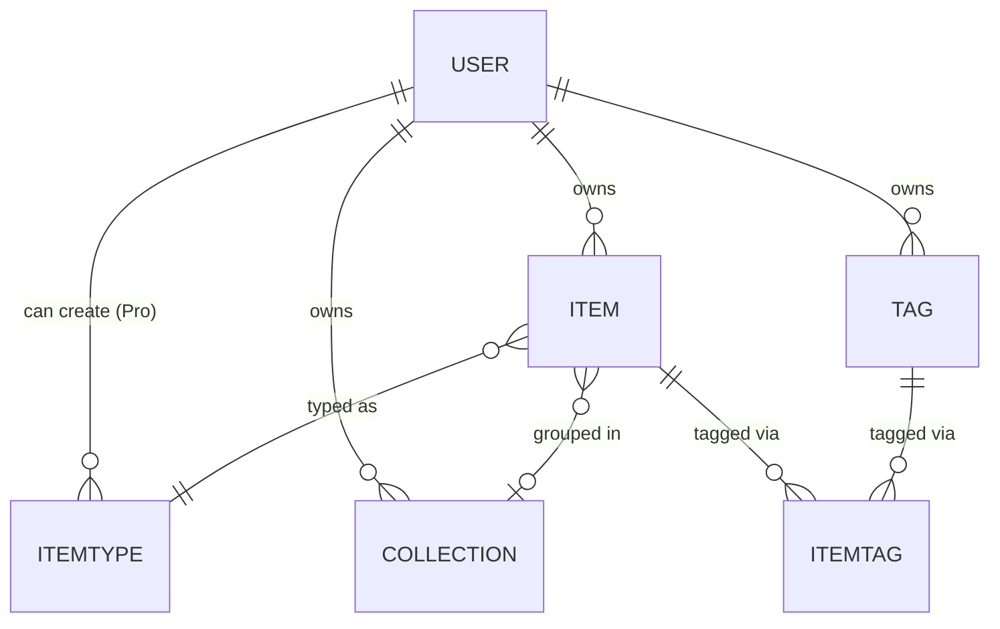
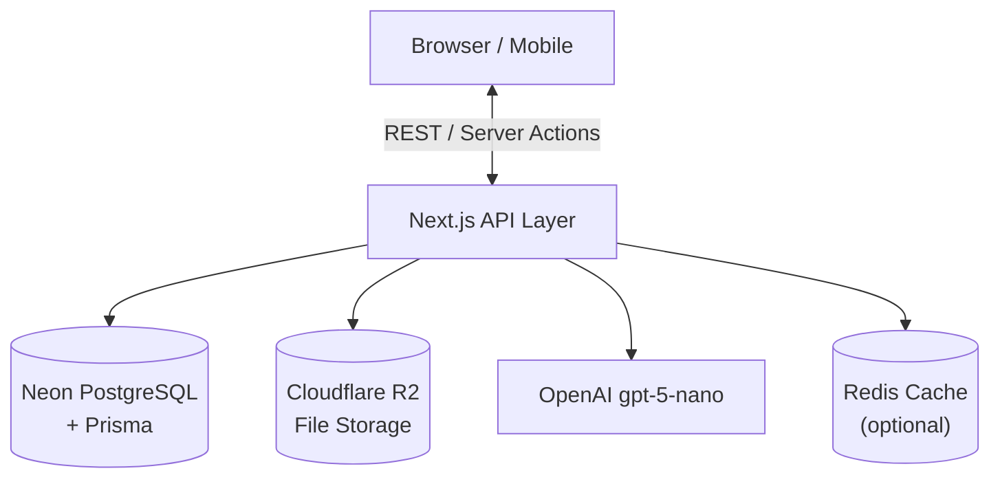
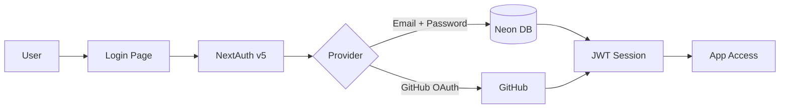
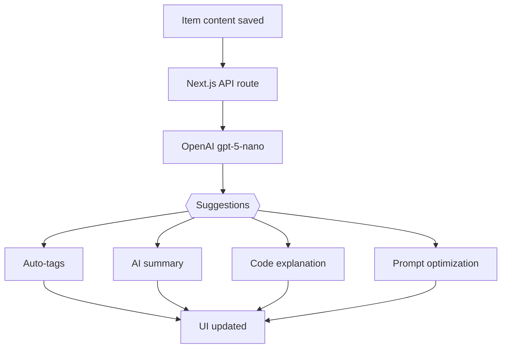

# DevNest 🗂️

> **Centralized Developer Knowledge Hub** — Store Smarter. Build Faster.

## Problem

Developers keep their essentials scattered across too many places:

| Where it lives now                       | What's lost               |
| ---------------------------------------- | ------------------------- |
| Snippets in VS Code / Notion             | Context switching         |
| AI prompts buried in chats               | Lost knowledge            |
| Docs in random folders                   | Inconsistent workflows    |
| Commands in `.txt` files or bash history | Wasted time re-searching  |
| Links in bookmarks, templates in gists   | No single source of truth |

**DevNest is one searchable, AI-enhanced hub for all dev knowledge and resources.**

## Users

| Persona                    | Core Need                                 |
| -------------------------- | ----------------------------------------- |
| Everyday Developer         | Quick access to snippets, commands, links |
| AI-First Developer         | Store prompts, workflows, context files   |
| Content Creator / Educator | Save course notes, reusable code          |
| Full-Stack Builder         | Patterns, boilerplates, API references    |

---

## Tech Stack

| Category     | Choice                             |
| ------------ | ---------------------------------- |
| Framework    | Next.js (React 19)                 |
| Language     | TypeScript                         |
| Database     | Neon PostgreSQL + Prisma ORM       |
| Caching      | Redis (optional)                   |
| File Storage | Cloudflare R2                      |
| CSS / UI     | Tailwind CSS v4 + ShadCN           |
| Auth         | NextAuth v5 (email + GitHub OAuth) |
| AI           | OpenAI gpt-5-nano                  |
| Deployment   | Vercel                             |
| Monitoring   | Sentry (post-MVP)                  |

## Core Features

### Item Types (System)

`Snippet` · `Prompt` · `Note` · `Command` · `File` · `Image` · `URL`

> Pro users can create custom item types.

### Collections

Group mixed item types into named collections (e.g. _React Patterns_, _Python Snippets_, _Context Files_).

### Search

Full-text search across content, tags, titles, and item types.

### Authentication

Email + Password and GitHub OAuth via NextAuth v5.

### Item Features

- Favorites & pinned items
- Recently used
- Markdown editor for text items
- File uploads (images, docs, templates) → stored on Cloudflare R2
- Import from files
- Export as JSON or ZIP
- Dark mode (default)

### AI Superpowers _(Pro)_

Powered by **OpenAI gpt-5-nano**

- Auto-tagging
- AI summaries
- Explain Code
- Prompt optimization

## Monetization

| Plan | Price          | Item Limit | Collections | AI  | File Uploads | Custom Types | Export |
| ---- | -------------- | ---------- | ----------- | --- | ------------ | ------------ | ------ |
| Free | $0             | 50         | 3           | ✗   | Images only  | ✗            | ✗      |
| Pro  | $8/mo · $72/yr | Unlimited  | Unlimited   | ✓   | All types    | ✓            | ✓      |

> Billing via **Stripe** with webhooks for subscription state sync.

## Data Model

```prisma
model User {
  id                   String       @id
  name                 String
  email                String       @unique
  emailVerified       Boolean
  image                String?
  password             String?
  isPro                Boolean      @default(false)
  stripeCustomerId     String?
  stripeSubscriptionId String?
  items                Item[]
  itemTypes            ItemType[]
  collections          Collection[]
  tags                 Tag[]
  createdAt            DateTime     @default(now())
  updatedAt            DateTime     @updatedAt

  @@map("user")
}

model Item {
  id           String      @id @default(uuid())
  title        String
  contentType  String      // "text" | "file"
  content      String?     // text-based items only
  fileUrl      String?
  fileName     String?
  fileSize     Int?
  url          String?
  description  String?
  language     String?     // syntax highlighting hint
  isFavorite   Boolean     @default(false)
  isPinned     Boolean     @default(false)
  userId       String
  user         User        @relation(fields: [userId], references: [id])
  typeId       String
  type         ItemType    @relation(fields: [typeId], references: [id])
  collectionId String?
  collection   Collection? @relation(fields: [collectionId], references: [id])
  tags         ItemTag[]
  createdAt    DateTime    @default(now())
  updatedAt    DateTime    @updatedAt
}

model ItemType {
  id       String  @id @default(uuid())
  name     String
  icon     String?
  color    String?
  isSystem Boolean @default(false) // true = built-in type
  userId   String?
  user     User?   @relation(fields: [userId], references: [id])
  items    Item[]
}

model Collection {
  id          String   @id @default(uuid())
  name        String
  description String?
  isFavorite  Boolean  @default(false)
  userId      String
  user        User     @relation(fields: [userId], references: [id])
  items       Item[]
  createdAt   DateTime @default(now())
  updatedAt   DateTime @updatedAt
}

model Tag {
  id     String    @id @default(uuid())
  name   String
  userId String
  user   User      @relation(fields: [userId], references: [id])
  items  ItemTag[]
}

model ItemTag {
  itemId String
  tagId  String
  item   Item   @relation(fields: [itemId], references: [id])
  tag    Tag    @relation(fields: [tagId], references: [id])

  @@id([itemId, tagId])
}
```

### Entity Relationships



## Architecture

### API Overview



### Auth Flow



### AI Feature Flow



## UI / UX

**Design direction:** dark-first, minimal, developer-friendly — inspired by Notion, Linear, and Raycast.

### Layout

```
┌─────────────────────────────────────────────────┐
│  Header: search bar · user menu · new item btn  │
├──────────────┬──────────────────────────────────┤
│   Sidebar    │         Main workspace           │
│  (collaps.)  │                                  │
│              │  Grid / List of items            │
│  Collections │                                  │
│  Item types  │  ┌────┐ ┌────┐ ┌────┐ ┌────┐   │
│  Tags        │  │item│ │item│ │item│ │item│   │
│  Favorites   │  └────┘ └────┘ └────┘ └────┘   │
│  Recent      │                                  │
├──────────────┴──────────────────────────────────┤
│  Item editor (full-screen overlay when open)    │
└─────────────────────────────────────────────────┘
```

- Collapsible sidebar with collections, types, tags, favorites, and recents
- Full-screen item editor with markdown support and syntax highlighting
- Mobile: sidebar becomes a drawer, touch-optimized buttons

### Screenshotsb

Below are the design screenshots for the dashboard. It doesn't have to be pixel perfect, but it should be close enough to what I have in mind.

- @/context/screenshots/dashboard-ui-main.png
- @/context/screenshots/dashboard-ui-drawer.png

## Roadmap

### MVP

- [ ] Items CRUD (all system types)
- [ ] Collections
- [ ] Full-text search
- [ ] Basic tagging
- [ ] Auth (email + GitHub)
- [ ] Free tier limits enforcement

### Pro Phase

- [ ] AI features (auto-tag, summary, explain, optimize)
- [ ] Custom item types
- [ ] File uploads → Cloudflare R2
- [ ] Export (JSON / ZIP)
- [ ] Stripe billing + upgrade flow

### Future

- [ ] Shared collections
- [ ] Team / Org plans
- [ ] VS Code extension
- [ ] Browser extension
- [ ] Public API + CLI tool
